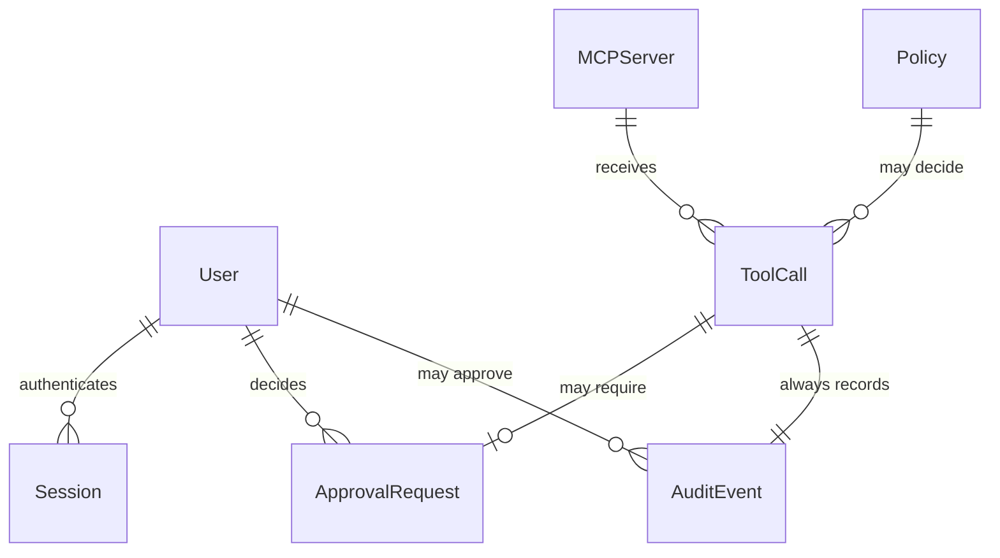

# mcp-firewall-mvp

Sources:

- `docs/mcp-firewall-prd.md` - fonte funcional principal: escopo do MVP, casos de uso, transportes, políticas, redaction, auditoria, dashboard, autenticação, usuários, CLI e modo headless.
- `docs/command-center-DESIGN.md` - fonte binding para a interface administrativa: workspace claro e quente, shell escuro translúcido, laranja como ação/telemetria e estados visuais enumerados.
- Repositório atual - não há código de produto, `AGENTS.md`, `.specs/STATE.md` ou convenção de implementação existente; decisões reversíveis de placement ficam para o diff, seguindo a arquitetura sugerida pelo PRD quando aplicável.

## Problem

Agentes de IA podem chamar ferramentas externas com permissões individuais e sem uma camada central que avalie agente, servidor, ferramenta, argumentos e aprovação humana. Isso permite operações destrutivas, acesso não governado e exposição de segredos, sem histórico único para explicar o que ocorreu.

O custo recai sobre desenvolvedores, DevOps, Platform Engineering, segurança e autores de MCP Servers: precisam configurar controles em vários lugares, não conseguem aplicar `default deny` de forma uniforme e não têm uma trilha de auditoria das decisões. O PRD não fornece métricas quantitativas de urgência ou conversão.

Quando o MVP estiver disponível, o usuário poderá colocar o firewall entre um agente e servidores MCP locais ou remotos, autorizar chamadas por políticas YAML, bloquear ou exigir aprovação, remover segredos antes do encaminhamento, consultar o histórico e operar sem dashboard quando não houver aprovação humana envolvida.

## Out of scope

| Excluded | Why |
| --- | --- |
| SaaS multi-tenant, organizações e times | explicitamente excluídos pelo PRD; o MVP é uma instalação única |
| Billing, planos e marketplace de políticas | não são necessários para validar o gateway local |
| SSO, OAuth, MFA e RBAC avançado | o MVP tem somente primeiro usuário e role `ADMIN` |
| Kubernetes, clusterização e alta disponibilidade | o MVP é um processo gateway local/único |
| Machine learning, classificação de risco por IA e policy engines OPA/Cedar | decisões são determinísticas e configuradas em YAML |
| Transportes MCP além de STDIO e Streamable HTTP | o PRD limita os transportes do MVP |
| Gerenciamento empresarial avançado de identidade | fora do primeiro fluxo autenticado |
| Alteração ou execução automática de políticas fora do YAML/admin do MVP | não há requisito de editor ou engine externo |

## Assumptions

| Assumption | Chosen default | Rationale | Confirmed? |
| --- | --- | --- | --- |
| Stack e organização do produto | seguir a estrutura `apps/`, `packages/` e `examples/` sugerida pelo PRD; escolher bibliotecas e placement conforme convenções descobertas durante a implementação | o repositório não contém código nem stack existente; fixar classes, pastas ou APIs internas agora criaria detalhe reversível | n |
| Contrato da decisão do gateway | `ALLOW`, `DENY` e `REQUIRE_APPROVAL`; redaction é transformação dos argumentos antes da decisão/encaminhamento | reproduz literalmente o modelo do Policy Engine no PRD | n |
| Ausência de política | `DENY`, sem chamada ao servidor alvo | o PRD define `default deny` e exige permissão explícita | n |
| Precedência de múltiplas políticas | `DENY` > `REQUIRE_APPROVAL` > `ALLOW`; somente políticas `enabled` participam | reproduz a precedência e o campo `enabled` do PRD | n |
| Wildcard | `*` casa qualquer sequência no campo `agent`, `server` ou `tool`; `postgres.*` casa ferramentas com esse prefixo | torna executáveis os exemplos de match do PRD sem introduzir expressões regulares | n |
| Redaction | aplicar categorias API keys, tokens, passwords, private keys e environment secrets; substituir o valor detectado por `[REDACTED]` nos argumentos encaminhados e registrados | cobre exatamente as categorias iniciais e o exemplo do PRD; evita persistir o segredo bruto | n |
| Solicitação sem mecanismo de aprovação | não executar `REQUIRE_APPROVAL` e retornar erro MCP de execução pendente/não disponível | o PRD proíbe usar aprovação humana sem mecanismo disponível; o código exato do erro MCP segue a biblioteca/protocolo adotado | n |
| Decisão de aprovação | uma solicitação `PENDING` só pode seguir para `APPROVED` ou `REJECTED`; aprovação executa uma única chamada e rejeição nunca encaminha | reproduz o fluxo de estados do PRD e fecha a duplicação do efeito externo | n |
| Autenticação do dashboard | primeiro cadastro só é permitido quando não existe usuário; depois, login cria sessão persistente com expiração, logout a invalida e rotas privadas exigem sessão válida | cobre o fluxo e os requisitos de segurança descritos no PRD | n |
| Credencial | armazenar somente hash apropriado para senha; role inicial única `ADMIN` | o PRD não escolhe algoritmo, e a escolha deve seguir a biblioteca de senha aprovada durante a implementação | n |
| Interface administrativa | dashboard web consome uma API HTTP local sob `/api`; recursos são autenticação, resumo, tool calls/auditoria, policies, MCP servers e approvals; códigos usados são `200`, `201`, `204`, `400`, `401`, `403`, `404`, `409` e `422` conforme operação | o PRD exige dashboard, áreas e operações, mas não nomeia rotas; um namespace único mantém o contrato local e revisável | n |
| Headless | `start --headless` inicia gateway, policy engine e logs; dashboard e operações que exigem aprovação ficam indisponíveis | reproduz explicitamente o comportamento headless do PRD | n |
| Persistência | usar armazenamento local configurável pela implementação para políticas, servidores, usuários, sessões, aprovações e auditoria; não há backfill porque não existem dados no repositório | o MVP precisa sobreviver a reinícios, mas o PRD não determina banco; a escolha concreta é reversível, salvo os contratos listados em Landing | n |

**Open questions:** none - todos os pontos em aberto foram registrados com default e rationale acima; defaults ainda não foram confirmados por uma pessoa.

## Criteria

### S1: Gateway protege uma chamada MCP (P1)

**Acceptance Criteria**

1. WHEN um agente envia uma chamada de ferramenta ao gateway THEN o sistema SHALL identificar e disponibilizar na avaliação os valores de `agent`, `server`, `tool` e `arguments`.
2. WHEN uma política `enabled` casa explicitamente agente, servidor e ferramenta com ação `allow` e nenhuma política mais restritiva casa THEN o sistema SHALL encaminhar a chamada ao MCP Server alvo e devolver o resultado MCP ao agente.
3. WHEN uma política aplicável tem ação `deny` THEN o sistema SHALL devolver uma falha MCP de bloqueio e SHALL não enviar a chamada ao MCP Server alvo.
4. WHEN nenhuma política `enabled` casa a chamada THEN o sistema SHALL aplicar a decisão `DENY` e SHALL não enviar a chamada ao MCP Server alvo.
5. WHEN múltiplas políticas `enabled` são aplicáveis THEN o sistema SHALL escolher `DENY` antes de `REQUIRE_APPROVAL` e `REQUIRE_APPROVAL` antes de `ALLOW`.
6. WHEN o transporte configurado do servidor alvo é `stdio` THEN o sistema SHALL iniciar/comunicar com o processo MCP local por STDIO.
7. WHEN o transporte configurado do servidor alvo é `http` THEN o sistema SHALL comunicar com o servidor MCP remoto por Streamable HTTP.

**Independent test:** configurar uma política de leitura e uma de bloqueio, enviar chamadas por STDIO e Streamable HTTP e observar encaminhamento somente no caso permitido.

### S2: Redaction e auditoria (P1)

**Acceptance Criteria**

8. WHEN os argumentos contêm uma API key, token, password, private key ou environment secret detectável THEN o sistema SHALL substituir cada valor detectado por `[REDACTED]` antes de encaminhar a chamada.
9. WHEN uma chamada é permitida, bloqueada ou aguarda aprovação THEN o sistema SHALL persistir um evento de auditoria contendo `id`, `agent`, `server`, `tool`, `arguments`, `decision`, `policy`, `duration`, `result` e `created_at`.
10. IF uma chamada contém segredo detectado THEN o sistema SHALL persistir no evento somente os argumentos redigidos e SHALL não persistir o valor secreto bruto.

**Independent test:** enviar cada categoria inicial de segredo em argumentos e verificar encaminhamento e evento de auditoria sem o valor original.

### S3: Aprovação humana (P1)

**Acceptance Criteria**

11. WHEN a decisão for `REQUIRE_APPROVAL` e houver mecanismo de aprovação disponível THEN o sistema SHALL persistir uma solicitação `PENDING` com agente, ferramenta, servidor, argumentos, data da solicitação e política.
12. WHEN um usuário autenticado aprovar uma solicitação `PENDING` THEN o sistema SHALL mudar o estado para `APPROVED`, executar a chamada uma vez e registrar `approved_by` e `approved_at`.
13. WHEN um usuário autenticado rejeitar uma solicitação `PENDING` THEN o sistema SHALL mudar o estado para `REJECTED` e SHALL não enviar a chamada ao MCP Server alvo.
14. IF a decisão for `REQUIRE_APPROVAL` e não houver mecanismo de aprovação disponível THEN o sistema SHALL não enviar a chamada ao MCP Server alvo e SHALL registrar a decisão no audit log.

**Independent test:** criar uma chamada pendente, aprová-la e rejeitá-la em execuções separadas; confirmar os estados, o executor único e a ausência de encaminhamento após rejeição.

### S4: Administração autenticada (P1)

**Acceptance Criteria**

15. WHEN não existir usuário cadastrado THEN o sistema SHALL permitir criar o primeiro usuário informando nome, email, senha e confirmação de senha com role `ADMIN`.
16. WHEN o primeiro usuário for criado THEN o sistema SHALL permitir login e SHALL redirecionar a sessão autenticada para o dashboard.
17. WHEN uma tentativa de login usar credenciais inválidas THEN o sistema SHALL rejeitar a autenticação e SHALL não criar uma sessão autenticada.
18. WHILE uma sessão estiver expirada ou invalidada por logout THEN o sistema SHALL rejeitar o acesso às rotas privadas do dashboard.
19. WHEN um administrador listar, criar, editar, ativar, desativar ou excluir uma política THEN o sistema SHALL persistir a operação e exibir a representação YAML da política.
20. WHEN um administrador cadastrar um MCP Server THEN o sistema SHALL persistir `name`, `transport`, `command/url` e status inicial, aceitando somente `stdio` ou `http` como transporte do MVP.
21. WHEN o administrador abrir o dashboard THEN o sistema SHALL exibir totais de chamadas, allowed, blocked e requires approval, chamadas ao longo do tempo, ferramentas mais usadas, chamadas recentes, políticas ativas e segredos interceptados.
22. WHEN o administrador abrir Tool Calls ou Audit Logs e selecionar uma chamada THEN o sistema SHALL exibir agente, ferramenta, servidor, decisão, resultado, duração, argumentos redigidos, política e dados de aprovação quando existirem.
23. WHEN o administrador abrir Approvals THEN o sistema SHALL exibir solicitações `PENDING` com agente, ferramenta, servidor, argumentos redigidos, data da solicitação e política, com ações Approve e Reject.
24. WHEN o administrador abrir MCP Servers THEN o sistema SHALL exibir cada servidor com status `Connected`, `Disconnected` ou `Error`.

**Independent test:** executar primeiro acesso, login/logout, tentativa inválida e cada operação administrativa em uma instalação vazia e autenticada.

### S5: Operação por CLI e headless (P1)

**Acceptance Criteria**

25. WHEN o usuário executar `mcp-firewall init` THEN o sistema SHALL criar `mcp-firewall.yaml` no diretório de trabalho quando o arquivo não existir.
26. WHEN o usuário executar `mcp-firewall start` THEN o sistema SHALL carregar as políticas, informar as contagens `Policies loaded` e `MCP servers` e anunciar `Gateway running` e o endereço `http://localhost:3210` conforme o formato do PRD.
27. WHEN o usuário executar `mcp-firewall start --headless` THEN o sistema SHALL iniciar proxy MCP, policy engine e logs sem exigir dashboard.
28. IF o usuário executar `mcp-firewall init` quando `mcp-firewall.yaml` já existir THEN o sistema SHALL recusar a sobrescrita e SHALL retornar código de saída diferente de zero.

**Independent test:** executar `init`, iniciar com e sem `--headless`, conferir saída, arquivo criado e código de saída da inicialização repetida.

## Traceability

| ID | Slice | Criteria | Status |
| --- | --- | --- | --- |
| GATE-01 | S1 | 1-7 | Pending |
| SEC-01 | S2 | 8-10 | Pending |
| APR-01 | S3 | 11-14 | Pending |
| ADM-01 | S4 | 15-24 | Pending |
| CLI-01 | S5 | 25-28 | Pending |

**ID format:** `CATEGORY-NUMBER`. **Status:** Pending -> In checks -> Implementing -> Verified.

## Observable

| Surface | Decision | Landing |
| --- | --- | --- |
| MCP `tools/call` over STDIO | entrada, saída e identificação de chamada | AC 1, AC 2 |
| MCP `tools/call` over STDIO | bloqueio, ausência de política e erro de encaminhamento | AC 3, AC 4 |
| MCP `tools/call` over Streamable HTTP | transporte e retorno ao agente | AC 6, AC 7 |
| MCP `tools/call` | redaction de argumentos | AC 8, AC 10 |
| MCP `tools/call` | comportamento sem mecanismo de aprovação | AC 14 |
| API administrativa `/api` | shape de sucesso e erro; autorização; versioning | AC 15-24; códigos `200`, `201`, `204`, `400`, `401`, `403`, `404`, `409`, `422`; n/a - API é interna ao dashboard do mesmo produto e não há versão externa no MVP |
| screen First access | vazio, validação/erro, loading e acesso não autorizado | AC 15; AC 17-18 |
| screen Login | erro de credencial, loading, logout e sessão expirada | AC 16-18 |
| screen Dashboard | loading, erro, estado sem chamadas e ordenação temporal das métricas | AC 21 |
| screen Tool Calls / Audit Logs | loading, erro, estado vazio, ordenação e detalhe da chamada | AC 9, AC 22 |
| screen Policies | loading, erro, estado vazio, ordenação, confirmação antes de excluir e representação YAML | AC 19 |
| screen MCP Servers | loading, erro, estado vazio, ordenação e statuses `Connected`, `Disconnected`, `Error` | AC 20, AC 24 |
| screen Approvals | loading, erro, estado vazio, ordenação por solicitação e confirmação antes de Approve/Reject | AC 11-13, AC 23 |
| command `mcp-firewall init` | saída, flags, defaults, erro de arquivo existente e exit codes | AC 25, AC 28 |
| command `mcp-firewall start` | saída, defaults e falha parcial de servidor/política | AC 26 |
| command `mcp-firewall start --headless` | saída, flags, ausência de dashboard e falha | AC 27 |
| collection de políticas | agrupamento por nome, ordenação, duplicatas e item inválido | AC 19; duplicata de nome é rejeitada com `409`; item inválido com `422` |

## Flow

O MVP cria o caminho completo porque o repositório não tem módulos existentes para reutilizar. O placement de módulos, classes e arquivos é reversível e será decidido durante a implementação conforme a estrutura sugerida no PRD; somente os contratos e entidades abaixo são congelados.

1. Agente envia `tools/call` -> interface MCP Server do gateway (new, no door - placement per conventions) - identifica agente/servidor/ferramenta e entrega `ToolCall` ao núcleo de decisão.
2. Gateway -> Policy Engine (new, no door - placement per conventions) - carrega políticas enabled, aplica match/wildcard e precedência, devolve `Decision`.
3. Gateway -> Secret Scanner (new, no door - placement per conventions) - redige argumentos antes de qualquer encaminhamento ou persistência e entrega a representação redigida aos próximos hops.
4. Para `ALLOW`, gateway -> MCP Client (new, no door - placement per conventions) - usa STDIO ou Streamable HTTP e encaminha ao MCP Server configurado.
5. Para `DENY`, gateway -> Audit Log (new, door 5) - persiste decisão sem chamar o servidor alvo e devolve erro MCP ao agente.
6. Para `REQUIRE_APPROVAL`, gateway -> Approval Engine (new, door 4) - cria `PENDING`, aguarda ação autenticada e bifurca para `APPROVED`/execução única ou `REJECTED`/sem encaminhamento.
7. API administrativa -> Dashboard web (new, no door - placement per conventions) - autentica usuário e lê/escreve políticas, servidores, chamadas, auditoria e aprovações; CLI inicializa configuração e inicia o mesmo gateway em modo normal ou headless.

## Relations

One-way constraints: `Decision` has only `ALLOW`, `DENY`, `REQUIRE_APPROVAL` (door 1); `Transport` has only `stdio`, `http` (door 2); approval state has `PENDING`, `APPROVED`, `REJECTED` with only the transitions in S3 (door 3); one `ToolCall` has exactly one `AuditEvent` (door 5). No columns and no types here - ordinary storage details follow the eventual repository conventions.

## Surface

| Route | In | Out | Status |
| --- | --- | --- | --- |
| MCP `tools/call` via STDIO | agente, servidor, ferramenta, argumentos | resultado MCP ou erro MCP de `DENY`/pendência | `200` encaminhado, `403` `DENY`, `409` aprovação indisponível, `502` erro de transporte |
| MCP `tools/call` via Streamable HTTP | mesma chamada MCP e configuração `http` | resultado MCP ou erro MCP | `200` sucesso, `403` `DENY`, `409` aprovação indisponível, `502` erro de transporte |
| `POST /api/auth/setup` | nome, email, senha, confirmação | usuário criado ou erro | `201`, `400`, `409`, `422` |
| `POST /api/auth/login` | email e senha | sessão autenticada ou erro | `200`, `401`, `422` |
| `POST /api/auth/logout` | sessão válida | resposta vazia | `204`, `401` |
| `GET /api/dashboard` | sessão válida | métricas e séries do dashboard | `200`, `401`, `500` |
| `GET /api/policies` | sessão válida | lista/detalhe ou erro | `200`, `401`, `403`, `404`, `422` |
| `POST /api/policies` | sessão válida e representação da política | política criada ou erro | `201`, `401`, `403`, `409`, `422` |
| `PATCH /api/policies` | sessão válida e representação da política | política alterada/ativada/desativada ou erro | `200`, `401`, `403`, `404`, `422` |
| `DELETE /api/policies` | sessão válida | resposta vazia ou erro | `204`, `401`, `403`, `404`, `409` |
| `GET /api/mcp-servers` | sessão válida | lista de servidores e status | `200`, `401`, `403` |
| `POST /api/mcp-servers` | sessão válida e configuração do servidor | servidor cadastrado ou erro | `201`, `401`, `403`, `422` |
| `GET /api/tool-calls` | sessão válida e filtros opcionais | coleção e detalhe de chamadas | `200`, `401`, `404`, `422` |
| `GET /api/audit-logs` | sessão válida e filtros opcionais | coleção e detalhe de eventos | `200`, `401`, `404`, `422` |
| `POST /api/approvals/:id/approve` | sessão válida | aprovação e resultado da execução ou erro | `200`, `401`, `403`, `404`, `409` |
| `POST /api/approvals/:id/reject` | sessão válida | rejeição ou erro | `200`, `401`, `403`, `404`, `409` |
| `mcp-firewall init` | diretório de trabalho | `mcp-firewall.yaml` e mensagem de resultado | exit `0` sucesso; exit `1` em arquivo existente ou falha (`500` no diagnóstico de inicialização) |
| `mcp-firewall start [--headless]` | configuração YAML e armazenamento local | mensagens de carga e estado do gateway | exit `0` em execução; exit `1` em configuração/arranque inválido (`500` no diagnóstico de inicialização) |

## Landing

| One-way door | Literal shape | Alternative rejected |
| --- | --- | --- |
| Decisão do Policy Engine | enum literal `ALLOW`, `DENY`, `REQUIRE_APPROVAL`, com precedência `DENY > REQUIRE_APPROVAL > ALLOW` | boolean `allowed` - não expressa aprovação pendente nem a precedência de decisão |
| Transportes MCP do MVP | enum literal `stdio`, `http`, mapeado a STDIO e Streamable HTTP | aceitar transporte arbitrário - amplia o contrato e o suporte além do escopo do PRD |
| Política declarativa | documento YAML com `version: 1`, raiz `policies` e match por `agent`, `server`, `tool`, ação e `enabled` | DSL própria ou policy engine externo - não corresponde ao formato configurável exigido pelo PRD |
| Estados de aprovação | enum literal `PENDING`, `APPROVED`, `REJECTED`; somente `PENDING -> APPROVED` ou `PENDING -> REJECTED` | boolean `approved` - não representa rejeição explícita nem estado pendente |
| Redaction | marcador literal `[REDACTED]` e categorias iniciais API keys, tokens, passwords, private keys e environment secrets | mascarar somente na UI - permitiria que o segredo chegasse ao MCP Server ou ao audit log |
| Audit event | um evento persistido por cada `ToolCall`, incluindo chamadas bloqueadas, com valores redigidos | log textual sem entidade/estrutura - não sustenta filtros, detalhe, métricas e prova de chamadas bloqueadas |
| Sessão administrativa | sessão persistida com expiração e invalidação explícita por logout; senha armazenada somente como hash | guardar senha em texto puro ou autenticar cada rota por email - viola o requisito de segurança e não permite logout/expiração |
| Contrato administrativo | API local sob prefixo literal `/api` com códigos de sucesso/erro definidos em Surface | expor banco ou chamar módulos internos diretamente da UI - acopla consumidor ao armazenamento e não define erros |
| CLI de inicialização | comandos literais `mcp-firewall init`, `mcp-firewall start` e flag `--headless`; `init` não sobrescreve arquivo existente | somente configuração manual ou um único comando com comportamento implícito - não cobre a instalação/execução exigidas pelo PRD |

- Nothing else in this change is hard to reverse; bibliotecas, pastas, nomes de classes, queries, layout visual e detalhes de payload não listados como contrato serão decididos no diff conforme as convenções que surgirem.

## Impact

| Front | What changes |
| --- | --- |
| domain | novos termos `ToolCall`, `Decision`, `Policy`, `MCPServer`, `ApprovalRequest`, `AuditEvent`, `User` e `Session`; suas definições são as do PRD e serão o vocabulário comum do gateway e dashboard |
| domain | `ALLOW`, `DENY`, `REQUIRE_APPROVAL`, `PENDING`, `APPROVED`, `REJECTED`, `Connected`, `Disconnected`, `Error` tornam-se valores observáveis usados por Policy Engine, aprovação, API e UI; não há callers existentes no repositório |
| stored data | instalação nova: nenhuma migração ou backfill; a persistência inicial cria apenas dados do MVP |
| runtime | o processo passa a ocupar a posição intermediária entre agente e MCP Server e pode iniciar subprocessos STDIO ou conexões Streamable HTTP |
| operations | `mcp-firewall.yaml`, comandos CLI, porta local `3210` e prefixo `/api` tornam-se contratos de operação do MVP |
| security | argumentos redigidos e eventos de auditoria passam a ser a fonte administrativa; nenhum segredo detectado deve chegar ao alvo ou ser persistido em bruto |
